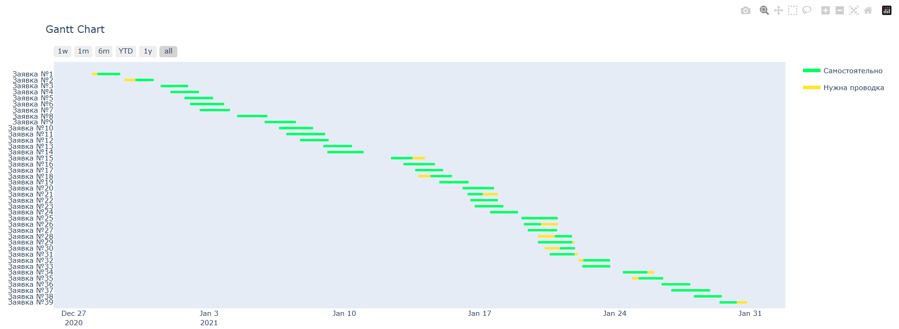

[🇷🇺 Русский](README_RU.md)

In September 2023, the Numerum team participated in the Digital Breakthrough Hockathon. We tackled the case "Scheduling Nuclear Icebreakers for the Northern Sea Route" and took third place with our project.

# Launching the program

To use the program, run the ShipTraffic.exe file, do not move the file to other directories.

To run a program using Python, install the required dependencies using the command `pip install -r requirements.txt`.
Wait for the installation to complete, then enter the command `python main.py` to run the code.

Please note that moving the program files will prevent the program from running.

## License

MIT. See file [LICENSE](LICENSE).
